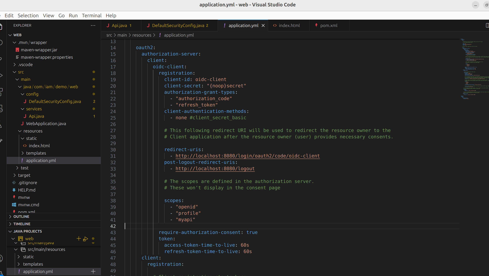
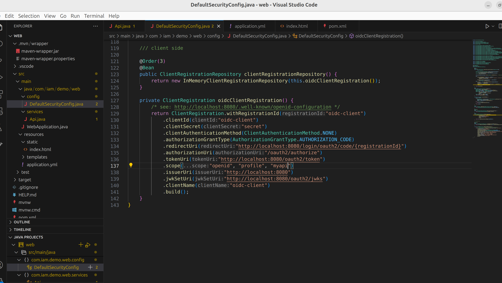
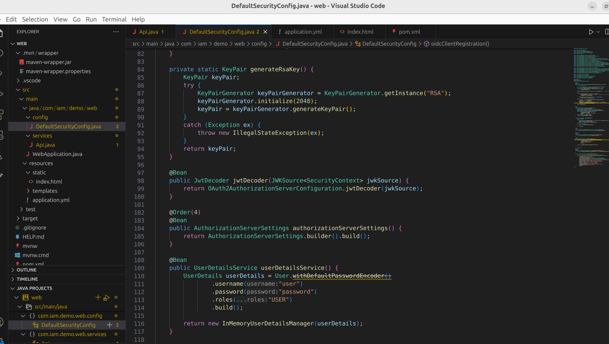
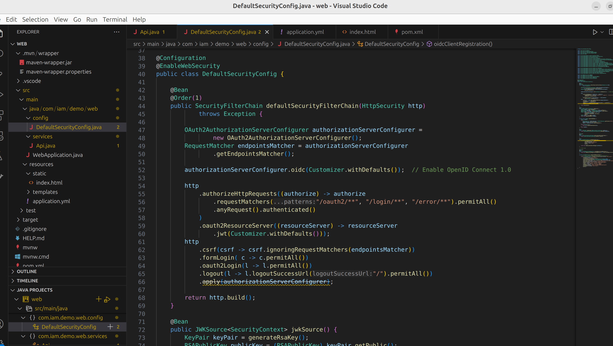
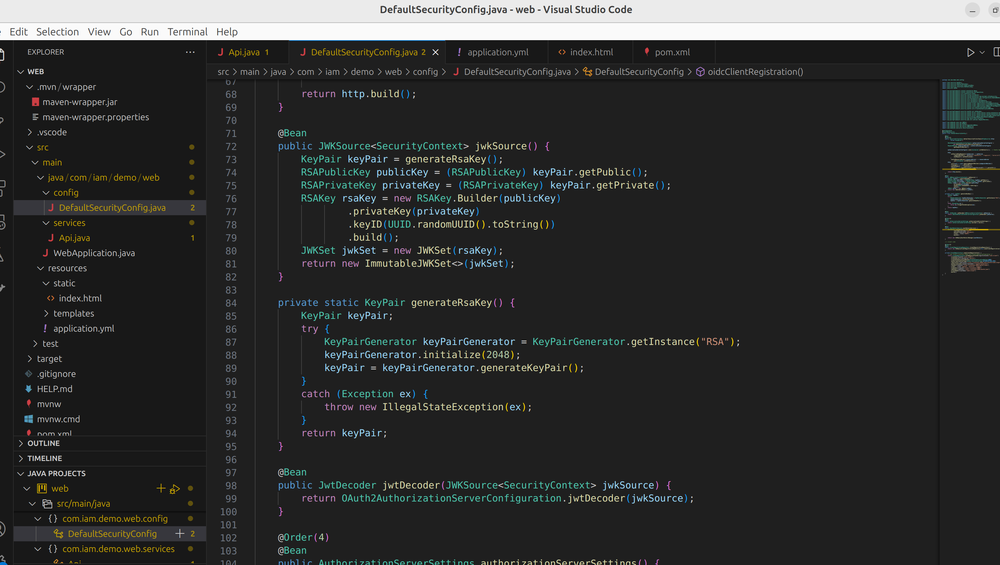
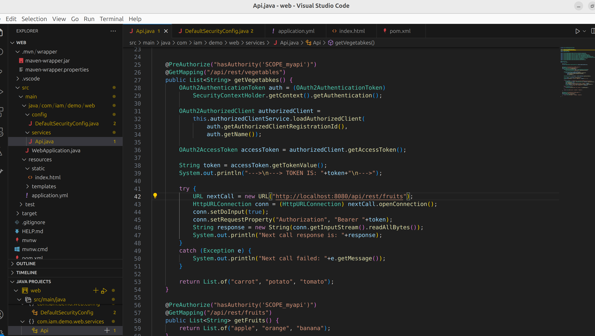
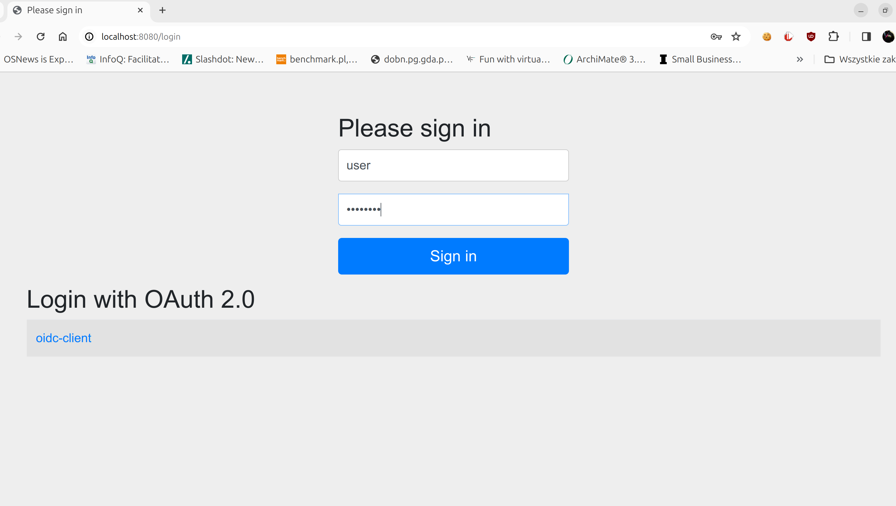
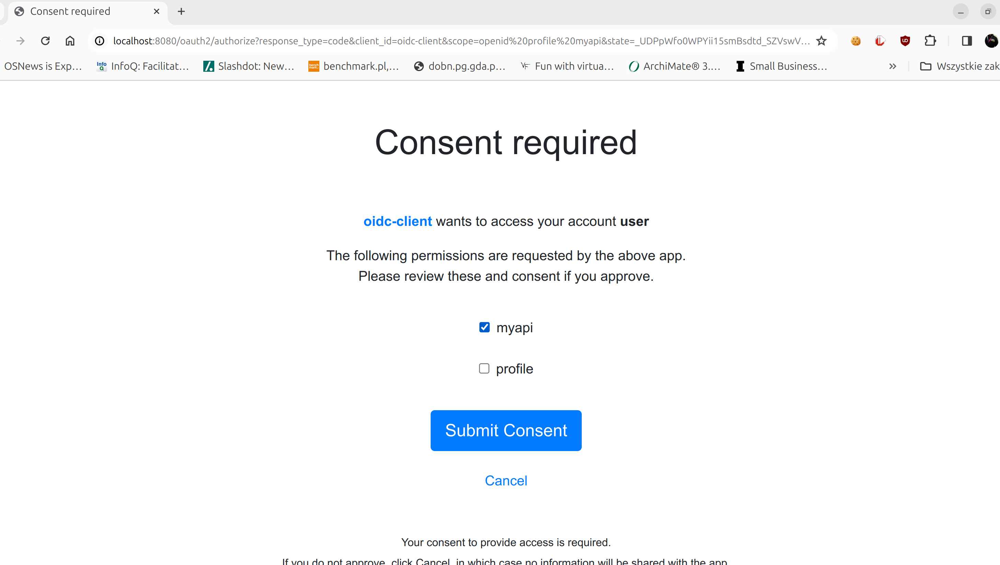
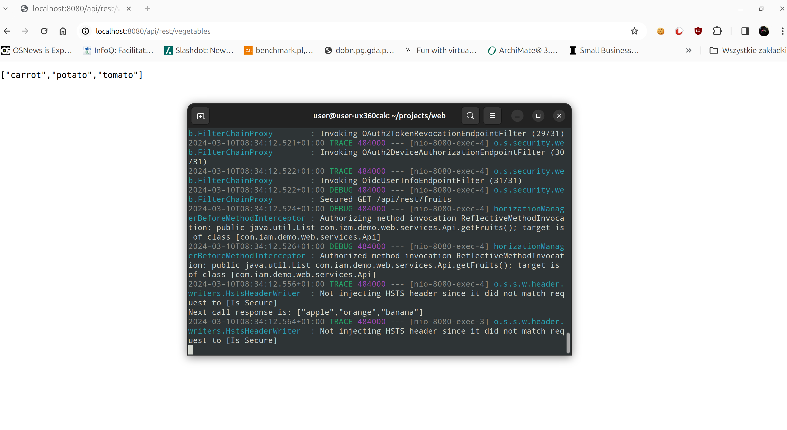

# springboot-oauth2-demo-2024
Demo of OAuth2 using Spring Boot and HTML

The goal of this exercise is to verify OAuth2/OIDC1 built-in capabilities in Spring Boot.
We are going to have some shortcuts: Authorization Server, microservice and Single Page Application would be in the same codebase.
This constraint forces us to have some hacks in configuration.

Here is our simple API to be protected

Here's the demo to steal JWT and use in next API call

Lesson learnt: use unique scope per microservice with fine grained access control for GET, POST, PUT, PATCH, DELETE
